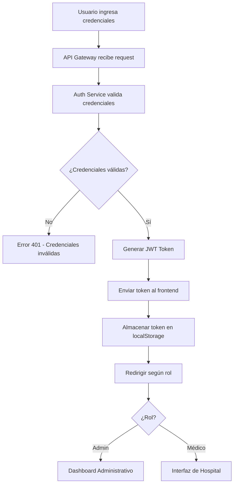

# 🏥 Sistema de Gestión Hospitalaria - HospitalApp

[](https://nodejs.org/)
[](https://reactjs.org/)
[](https://www.typescriptlang.org/)
[](https://www.mysql.com/)
[](https://docker.com/)
[](LICENSE)

## 📋 Descripción del Proyecto

**HospitalApp** es un sistema integral de gestión hospitalaria desarrollado con **arquitectura de microservicios** que permite la administración de múltiples centros médicos distribuidos geográficamente. El sistema implementa bases de datos distribuidas, replicación de datos y servicios web para garantizar la escalabilidad, disponibilidad y mantenibilidad del servicio.

### 🎯 Características Principales

- ✅ **Arquitectura de Microservicios** con Node.js y Express
- ✅ **Bases de Datos Distribuidas** con MySQL (Central, Guayaquil, Cuenca)
- ✅ **APIs RESTful** para administración y consultas médicas
- ✅ **Interfaces de Usuario** diferenciadas por roles (Admin/Hospital)
- ✅ **Sistema de Autenticación** con JWT y roles
- ✅ **Reportes Avanzados** con exportación a PDF
- ✅ **Gestión de Consultas** independiente por centro médico
- ✅ **Containerización** con Docker y Docker Compose
- ✅ **Logging y Monitoreo** con Winston
- ✅ **Validaciones Robustas** en frontend y backend

## 🚀 Inicio Rápido

### Instalación con Docker (Recomendado)

```bash
# Clonar el repositorio
git clone <repository-url>
cd AD-GestionHospitalaria

# Ejecutar con Docker Compose
cd hospital-app/microservices
docker-compose up -d

# Ejecutar frontend
cd ../frontend/vite-project
npm install
npm run dev
```

### Acceso a la Aplicación

- **Frontend**: http://localhost:5173
- **API Gateway**: http://localhost:3000
- **Servicios**: http://localhost:3001-3005

## 📚 Documentación Completa

Para información detallada sobre cada componente del sistema, consulta:

- 📖 **[Documentación Principal](hospital-app/README.md)** - Guía completa del sistema
- 🎨 **[Documentación Frontend](hospital-app/frontend/FRONTEND_DOCUMENTATION.md)** - React, TypeScript, Vite
- 🔐 **[Documentación Seguridad](hospital-app/README_SEGURIDAD.md)** - Autenticación y autorización
- 📋 **[Documentación Validaciones](hospital-app/README_VALIDACIONES.md)** - Validaciones y reglas de negocio

## 🏗️ Arquitectura del Sistema

### Diagrama de Arquitectura

```
┌─────────────────────────────────────────────────────────────┐
│                    FRONTEND (React + Vite)                 │
├─────────────────────────────────────────────────────────────┤
│  ┌─────────────────┐  ┌─────────────────┐  ┌─────────────┐ │
│  │   Admin Panel   │  │  Hospital UI    │  │  Dashboard  │ │
│  │   (React)       │  │  (React)        │  │  (React)    │ │
│  └─────────────────┘  └─────────────────┘  └─────────────┘ │
└─────────────────────────────────────────────────────────────┘
                              │
                              ▼
┌─────────────────────────────────────────────────────────────┐
│                    API GATEWAY (Puerto 3000)               │
├─────────────────────────────────────────────────────────────┤
│  ┌─────────────────┐  ┌─────────────────┐  ┌─────────────┐ │
│  │  Auth Service   │  │  Admin Service  │  │  Reports    │ │
│  │  (Puerto 3001)  │  │  (Puerto 3002)  │  │  Service    │ │
│  └─────────────────┘  └─────────────────┘  └─────────────┘ │
│  ┌─────────────────┐  ┌─────────────────┐                  │
│  │ Consultas Svc   │  │  Users Service  │                  │
│  │  (Puerto 3003)  │  │  (Puerto 3004)  │                  │
│  └─────────────────┘  └─────────────────┘                  │
└─────────────────────────────────────────────────────────────┘
                              │
                              ▼
┌─────────────────────────────────────────────────────────────┐
│                DATABASES DISTRIBUTED                        │
├─────────────────────────────────────────────────────────────┤
│  ┌─────────────────┐  ┌─────────────────┐  ┌─────────────┐ │
│  │  Central DB     │  │  Guayaquil DB   │  │  Cuenca DB  │ │
│  │  (Puerto 3307)  │  │  (Puerto 3308)  │  │  (Puerto 3309) │
│  │  Quito          │  │  Guayaquil      │  │  Cuenca     │ │
│  └─────────────────┘  └─────────────────┘  └─────────────┘ │
└─────────────────────────────────────────────────────────────┘
```

### Microservicios

| Servicio | Puerto | Responsabilidad | Base de Datos |
|----------|--------|-----------------|---------------|
| **API Gateway** | 3000 | Enrutamiento, autenticación, proxy | - |
| **Auth Service** | 3001 | Autenticación, usuarios, JWT | Todas las BD |
| **Admin Service** | 3002 | Gestión de médicos, centros, especialidades | Todas las BD |
| **Consultas Service** | 3003 | Consultas médicas, pacientes | Todas las BD |
| **Users Service** | 3004 | Gestión de usuarios del sistema | Todas las BD |
| **Reports Service** | 3005 | Reportes y estadísticas | Todas las BD |

## 🛠️ Tecnologías Utilizadas

### Backend (Microservicios)
- **Node.js** (v18+) - Runtime de JavaScript
- **Express.js** (v5.1.0) - Framework web
- **TypeScript** (v5.9.2) - Tipado estático
- **MySQL2** (v3.15.0) - Driver de base de datos
- **JWT** (v9.0.2) - Autenticación
- **bcryptjs** (v3.0.2) - Encriptación de contraseñas
- **Winston** (v3.11.0) - Logging
- **Docker** (v24+) - Containerización

### Frontend
- **React** (v19.1.1) - Biblioteca de UI
- **TypeScript** (v5.8.3) - Tipado estático
- **Vite** (v7.1.2) - Build tool y dev server
- **Tailwind CSS** (v4.1.13) - Framework CSS
- **Zustand** (v5.0.8) - Estado global
- **Recharts** (v3.2.1) - Gráficos y visualizaciones
- **jsPDF** (v3.0.3) - Generación de PDFs

## 🚀 Tecnologías Utilizadas

### Backend (Microservicios)
- **Node.js** (v18+) - Runtime de JavaScript
- **Express.js** (v5.1.0) - Framework web
- **TypeScript** (v5.9.2) - Tipado estático
- **MySQL2** (v3.15.0) - Driver de base de datos
- **JWT** (v9.0.2) - Autenticación
- **bcryptjs** (v3.0.2) - Encriptación de contraseñas
- **CORS** (v2.8.5) - Cross-Origin Resource Sharing
- **Winston** (v3.11.0) - Logging
- **Express-validator** (v7.0.1) - Validaciones
- **Express-rate-limit** (v7.1.5) - Rate limiting
- **Helmet** (v7.1.0) - Seguridad HTTP

### Frontend
- **React** (v19.1.1) - Biblioteca de UI
- **TypeScript** (v5.8.3) - Tipado estático
- **Vite** (v7.1.2) - Build tool y dev server
- **Tailwind CSS** (v4.1.13) - Framework CSS
- **React Router** (v7.8.2) - Enrutamiento
- **Zustand** (v5.0.8) - Estado global
- **Recharts** (v3.2.1) - Gráficos y visualizaciones
- **React Big Calendar** (v1.19.4) - Componente de calendario
- **jsPDF** (v3.0.3) - Generación de PDFs
- **Lucide React** (v0.542.0) - Iconos
- **Moment.js** (v2.30.1) - Manipulación de fechas

### Base de Datos y DevOps
- **MySQL** (v8.0+) - Sistema de gestión de base de datos
- **Docker** (v24+) - Containerización
- **Docker Compose** (v2.0+) - Orquestación de contenedores
- **Arquitectura Distribuida** - Múltiples instancias por región

## 📁 Estructura del Proyecto

```
hospital-app/
├── 📁 frontend/                    # Cliente React
│   └── 📁 vite-project/
│       ├── 📁 src/
│       │   ├── 📁 api/             # Servicios de API
│       │   │   ├── authApi.ts      # Autenticación
│       │   │   ├── adminApi.ts     # Administración
│       │   │   ├── consultasApi.ts # Consultas médicas
│       │   │   ├── pacientesApi.ts # Pacientes
│       │   │   ├── reportsApi.ts   # Reportes
│       │   │   └── apiInterceptor.ts # Interceptor HTTP
│       │   ├── 📁 components/      # Componentes reutilizables
│       │   ├── 📁 pages/           # Páginas de la aplicación
│       │   ├── 📁 hooks/           # Custom hooks
│       │   ├── 📁 layouts/        # Layouts de páginas
│       │   ├── 📁 routes/          # Configuración de rutas
│       │   ├── 📁 store/           # Estado global (Zustand)
│       │   ├── 📁 types/           # Definiciones de TypeScript
│       │   └── 📁 utils/           # Utilidades y helpers
│       ├── 📄 package.json         # Dependencias del frontend
│       ├── 📄 vite.config.ts       # Configuración de Vite
│       ├── 📄 tailwind.config.js   # Configuración de Tailwind
│       └── 📄 Dockerfile           # Containerización frontend
│
├── 📁 microservices/               # Microservicios
│   ├── 📁 api-gateway/             # Gateway principal
│   │   ├── index.js                # Servidor principal
│   │   ├── package.json            # Dependencias
│   │   └── Dockerfile              # Containerización
│   ├── 📁 auth-service/            # Servicio de autenticación
│   │   ├── index.js                # Lógica de autenticación
│   │   ├── package.json            # Dependencias
│   │   └── Dockerfile              # Containerización
│   ├── 📁 admin-service/           # Servicio de administración
│   │   ├── index.js                # CRUD de médicos, centros, etc.
│   │   ├── validation.js           # Validaciones
│   │   ├── package.json            # Dependencias
│   │   └── Dockerfile              # Containerización
│   ├── 📁 consultas-service/       # Servicio de consultas
│   │   ├── index.js                # Gestión de consultas médicas
│   │   ├── package.json            # Dependencias
│   │   └── Dockerfile              # Containerización
│   ├── 📁 users-service/           # Servicio de usuarios
│   │   ├── index.js                # Gestión de usuarios
│   │   ├── package.json            # Dependencias
│   │   └── Dockerfile              # Containerización
│   ├── 📁 reports-service/         # Servicio de reportes
│   │   ├── index.js                # Generación de reportes
│   │   ├── 📁 logs/                # Archivos de log
│   │   ├── package.json            # Dependencias
│   │   └── Dockerfile              # Containerización
│   ├── 📁 sql/                     # Scripts de base de datos
│   │   ├── setup-central.sql       # Configuración BD Central
│   │   ├── setup-guayaquil.sql     # Configuración BD Guayaquil
│   │   ├── setup-cuenca.sql        # Configuración BD Cuenca
│   │   ├── central.sql             # Estructura BD Central
│   │   ├── guayaquil.sql           # Estructura BD Guayaquil
│   │   ├── cuenca.sql              # Estructura BD Cuenca
│   │   └── configure-utf8.sql      # Configuración UTF-8
│   ├── 📄 docker-compose.yml       # Orquestación de servicios
│   ├── 📄 insert-sample-data.js    # Datos de prueba
│   └── 📄 reset-databases.js       # Reset de bases de datos
│
├── 📄 README.md                    # Este archivo
├── 📄 README_SEGURIDAD.md          # Documentación de seguridad
├── 📄 README_VALIDACIONES.md       # Documentación de validaciones
└── 📄 setup-hospital.js            # Script de configuración inicial
```

## 🛠️ Instalación y Configuración

### Prerrequisitos

- **Node.js** v18 o superior
- **MySQL** v8.0 o superior
- **Docker** v24+ y **Docker Compose** v2.0+
- **npm** o **yarn**

### 1. Clonar el Repositorio

```bash
git clone <repository-url>
cd hospital-app
```

### 2. Configuración con Docker (Recomendado)

#### Iniciar todos los servicios

```bash
cd microservices
docker-compose up -d
```

Este comando iniciará:
- 3 bases de datos MySQL (Central, Guayaquil, Cuenca)
- 5 microservicios (API Gateway, Auth, Admin, Consultas, Users, Reports)
- Configuración automática de redes y volúmenes

#### Verificar servicios

```bash
# Verificar contenedores
docker-compose ps

# Verificar logs
docker-compose logs -f

# Verificar conectividad
curl http://localhost:3000/health
```

### 3. Configuración Manual (Desarrollo)

#### Configurar Bases de Datos

```sql
-- Servidor Central (Quito) - Puerto 3307
CREATE DATABASE hospital_central;
CREATE USER 'admin_central'@'%' IDENTIFIED BY 'SuperPasswordCentral123!';
GRANT ALL PRIVILEGES ON hospital_central.* TO 'admin_central'@'%';

-- Servidor Guayaquil - Puerto 3308
CREATE DATABASE hospital_guayaquil;
CREATE USER 'admin_guayaquil'@'%' IDENTIFIED BY 'SuperPasswordGye123!';
GRANT ALL PRIVILEGES ON hospital_guayaquil.* TO 'admin_guayaquil'@'%';

-- Servidor Cuenca - Puerto 3309
CREATE DATABASE hospital_cuenca;
CREATE USER 'admin_cuenca'@'%' IDENTIFIED BY 'SuperPasswordCuenca123!';
GRANT ALL PRIVILEGES ON hospital_cuenca.* TO 'admin_cuenca'@'%';

FLUSH PRIVILEGES;
```

#### Ejecutar Scripts de Base de Datos

```bash
# Ejecutar scripts de configuración
mysql -u root -p < microservices/sql/setup-central.sql
mysql -u root -p < microservices/sql/setup-guayaquil.sql
mysql -u root -p < microservices/sql/setup-cuenca.sql

# Ejecutar scripts de estructura
mysql -u admin_central -p hospital_central < microservices/sql/central.sql
mysql -u admin_guayaquil -p hospital_guayaquil < microservices/sql/guayaquil.sql
mysql -u admin_cuenca -p hospital_cuenca < microservices/sql/cuenca.sql
```

#### Configurar Microservicios

```bash
# Instalar dependencias para todos los servicios
cd microservices
npm install

# Configurar variables de entorno
cp api-gateway/env.example api-gateway/.env
cp auth-service/env.example auth-service/.env
cp admin-service/env.example admin-service/.env
cp consultas-service/env.example consultas-service/.env
cp users-service/env.example users-service/.env
cp reports-service/env.example reports-service/.env
```

#### Variables de Entorno (.env)

```env
# API Gateway
NODE_ENV=development
PORT=3000
JWT_SECRET=SuperJWTSecret123!
AUTH_SERVICE_URL=http://localhost:3001
ADMIN_SERVICE_URL=http://localhost:3002
CONSULTAS_SERVICE_URL=http://localhost:3003
USERS_SERVICE_URL=http://localhost:3004
REPORTS_SERVICE_URL=http://localhost:3005

# Auth Service
NODE_ENV=development
PORT=3001
JWT_SECRET=SuperJWTSecret123!
DB_HOST=localhost
DB_USER=admin_central
DB_PASSWORD=SuperPasswordCentral123!
DB_PORT=3307
DB_NAME=hospital_central

# Admin Service
NODE_ENV=development
PORT=3002
JWT_SECRET=SuperJWTSecret123!
DB_HOST=localhost
DB_USER=admin_central
DB_PASSWORD=SuperPasswordCentral123!
DB_PORT=3307
DB_NAME=hospital_central

# Consultas Service
NODE_ENV=development
PORT=3003
JWT_SECRET=SuperJWTSecret123!
DB_HOST=localhost
DB_USER=admin_central
DB_PASSWORD=SuperPasswordCentral123!
DB_PORT=3307
DB_NAME=hospital_central

# Users Service
NODE_ENV=development
PORT=3004
JWT_SECRET=SuperJWTSecret123!
DB_HOST=localhost
DB_USER=admin_central
DB_PASSWORD=SuperPasswordCentral123!
DB_PORT=3307
DB_NAME=hospital_central

# Reports Service
NODE_ENV=development
PORT=3005
JWT_SECRET=SuperJWTSecret123!
DB_HOST=localhost
DB_USER=admin_central
DB_PASSWORD=SuperPasswordCentral123!
DB_PORT=3307
DB_NAME=hospital_central
```

#### Iniciar Microservicios

```bash
# Terminal 1 - API Gateway
cd microservices/api-gateway
npm start

# Terminal 2 - Auth Service
cd microservices/auth-service
npm start

# Terminal 3 - Admin Service
cd microservices/admin-service
npm start

# Terminal 4 - Consultas Service
cd microservices/consultas-service
npm start

# Terminal 5 - Users Service
cd microservices/users-service
npm start

# Terminal 6 - Reports Service
cd microservices/reports-service
npm start
```

### 4. Configurar Frontend

```bash
cd frontend/vite-project

# Instalar dependencias
npm install

# Configurar variables de entorno
cp .env.example .env.local
```

#### Variables de Entorno Frontend (.env.local)

```env
VITE_API_URL=http://localhost:3000/api
VITE_AUTH_URL=http://localhost:3001
VITE_ADMIN_URL=http://localhost:3002
VITE_CONSULTAS_URL=http://localhost:3003
VITE_USERS_URL=http://localhost:3004
VITE_REPORTS_URL=http://localhost:3005
VITE_APP_NAME=Sistema de Gestión Hospitalaria
VITE_APP_VERSION=1.0.0
VITE_DEBUG=true
```

#### Ejecutar Frontend

```bash
# Terminal 7 - Frontend
cd frontend/vite-project
npm run dev
```

### 5. Verificar Instalación

La aplicación estará disponible en:
- **Frontend**: http://localhost:5173
- **API Gateway**: http://localhost:3000
- **Auth Service**: http://localhost:3001
- **Admin Service**: http://localhost:3002
- **Consultas Service**: http://localhost:3003
- **Users Service**: http://localhost:3004
- **Reports Service**: http://localhost:3005

#### Endpoints de Verificación

```bash
# Verificar API Gateway
curl http://localhost:3000/health

# Verificar servicios individuales
curl http://localhost:3001/health
curl http://localhost:3002/health
curl http://localhost:3003/health
curl http://localhost:3004/health
curl http://localhost:3005/health

# Verificar conectividad entre servicios
curl http://localhost:3000/api/test-services
```

## 🔐 Sistema de Autenticación

### Roles de Usuario

1. **Administrador** (`admin`)
   - Acceso completo al sistema
   - Gestión de centros médicos
   - Gestión de médicos y empleados
   - Acceso a reportes globales
   - Gestión de usuarios
   - Acceso a todas las bases de datos

2. **Médico** (`medico`)
   - Acceso limitado a su centro médico
   - Gestión de consultas propias
   - Visualización de pacientes de su centro
   - Acceso a calendario personal
   - Reportes de su centro específico

### Flujo de Autenticación



### Seguridad Implementada

- **JWT Tokens** con expiración de 24 horas
- **Encriptación de contraseñas** con bcryptjs
- **Validación de tokens** en cada request
- **Protección de rutas** por rol
- **Rate limiting** para prevenir ataques
- **CORS** configurado correctamente
- **Helmet** para headers de seguridad

## 📊 Funcionalidades Principales

### 🏥 Gestión de Centros Médicos
- ✅ CRUD completo de centros médicos
- ✅ Asignación de personal por centro
- ✅ Gestión de ubicaciones y direcciones
- ✅ Estadísticas por centro
- ✅ Distribución geográfica (Quito, Guayaquil, Cuenca)

### 👨‍⚕️ Gestión de Personal Médico
- ✅ Registro de médicos con especialidades
- ✅ Asignación a centros médicos
- ✅ Gestión de empleados administrativos
- ✅ Control de acceso por roles
- ✅ Validaciones de integridad referencial

### 🩺 Sistema de Consultas Médicas
- ✅ Creación y gestión de consultas
- ✅ Estados de consulta (Pendiente, Programada, Completada, Cancelada)
- ✅ Asignación de pacientes a médicos
- ✅ Historial médico por paciente
- ✅ Calendario de consultas
- ✅ Validaciones de duración y fechas

### 📈 Sistema de Reportes
- ✅ Reportes por médico
- ✅ Estadísticas generales del centro
- ✅ Pacientes más frecuentes
- ✅ Gráficos y visualizaciones con Recharts
- ✅ Exportación a PDF con jsPDF
- ✅ Filtros por fecha y centro

### 👥 Gestión de Pacientes
- ✅ Registro de pacientes
- ✅ Historial médico
- ✅ Consultas activas
- ✅ Información de contacto
- ✅ Validaciones de datos personales

### 🔧 Gestión de Usuarios
- ✅ Creación de usuarios del sistema
- ✅ Asignación de roles y permisos
- ✅ Gestión de accesos por centro
- ✅ Validaciones de seguridad

## 🔌 API Endpoints

### Autenticación (Auth Service - Puerto 3001)
```
POST   /login                    # Iniciar sesión
POST   /register                 # Registrar usuario
POST   /verify-token             # Verificar token
GET    /usuarios                 # Listar usuarios
POST   /usuarios                 # Crear usuario
PUT    /usuarios/:id             # Actualizar usuario
DELETE /usuarios/:id             # Eliminar usuario
GET    /health                   # Estado del servicio
```

### Administración (Admin Service - Puerto 3002)
```
GET    /medicos                  # Listar médicos
POST   /medicos                  # Crear médico
PUT    /medicos/:id              # Actualizar médico
DELETE /medicos/:id              # Eliminar médico
GET    /medicos/centro/:id       # Médicos por centro

GET    /empleados                # Listar empleados
POST   /empleados                # Crear empleado
PUT    /empleados/:id            # Actualizar empleado
DELETE /empleados/:id            # Eliminar empleado

GET    /centros                  # Listar centros médicos
POST   /centros                  # Crear centro médico
PUT    /centros/:id              # Actualizar centro médico
DELETE /centros/:id              # Eliminar centro médico

GET    /especialidades           # Listar especialidades
POST   /especialidades           # Crear especialidad
PUT    /especialidades/:id       # Actualizar especialidad
DELETE /especialidades/:id       # Eliminar especialidad

GET    /pacientes                # Listar pacientes
POST   /pacientes                # Crear paciente
PUT    /pacientes/:id            # Actualizar paciente
DELETE /pacientes/:id            # Eliminar paciente
```

### Consultas Médicas (Consultas Service - Puerto 3003)
```
GET    /consultas                # Listar consultas
POST   /consultas                # Crear consulta
PUT    /consultas/:id            # Actualizar consulta
DELETE /consultas/:id            # Eliminar consulta

GET    /medicos-por-centro/:id   # Médicos por centro
GET    /pacientes-por-centro/:id # Pacientes por centro
GET    /pacientes                # Listar pacientes
POST   /pacientes                # Crear paciente
PUT    /pacientes/:id            # Actualizar paciente
DELETE /pacientes/:id            # Eliminar paciente

GET    /centros                  # Listar centros médicos
```

### Reportes (Reports Service - Puerto 3005)
```
GET    /reports/estadisticas           # Estadísticas generales
GET    /reports/consultas-medico       # Resumen de consultas por médico
GET    /reports/consultas-especialidad # Consultas por especialidad
GET    /reports/consultas-centro      # Consultas por centro
GET    /reports/pacientes-frecuentes   # Pacientes más frecuentes
GET    /consultas/medico/:id           # Detalle de consultas por médico
```

### API Gateway (Puerto 3000)
```
GET    /health                   # Estado del gateway
GET    /info                     # Información del sistema
GET    /api/test-services        # Verificar conectividad con microservicios

# Proxy a todos los servicios con prefijo /api
POST   /api/auth/login           # Proxy a Auth Service
GET    /api/admin/medicos        # Proxy a Admin Service
GET    /api/consultas            # Proxy a Consultas Service
GET    /api/reports/estadisticas # Proxy a Reports Service
```

## 🗄️ Modelo de Base de Datos

### Entidades Principales

```sql
-- Centros Médicos
CREATE TABLE centros_medicos (
    id INT PRIMARY KEY AUTO_INCREMENT,
    nombre VARCHAR(100) NOT NULL,
    ciudad VARCHAR(50) NOT NULL,
    direccion VARCHAR(200),
    telefono VARCHAR(20),
    created_at TIMESTAMP DEFAULT CURRENT_TIMESTAMP,
    updated_at TIMESTAMP DEFAULT CURRENT_TIMESTAMP ON UPDATE CURRENT_TIMESTAMP
);

-- Especialidades Médicas
CREATE TABLE especialidades (
    id INT PRIMARY KEY AUTO_INCREMENT,
    nombre VARCHAR(100) NOT NULL UNIQUE,
    created_at TIMESTAMP DEFAULT CURRENT_TIMESTAMP,
    updated_at TIMESTAMP DEFAULT CURRENT_TIMESTAMP ON UPDATE CURRENT_TIMESTAMP
);

-- Médicos
CREATE TABLE medicos (
    id INT PRIMARY KEY AUTO_INCREMENT,
    nombres VARCHAR(100) NOT NULL,
    apellidos VARCHAR(100) NOT NULL,
    cedula VARCHAR(20) NOT NULL UNIQUE,
    telefono VARCHAR(20),
    email VARCHAR(100),
    id_especialidad INT NOT NULL,
    id_centro INT NOT NULL,
    created_at TIMESTAMP DEFAULT CURRENT_TIMESTAMP,
    updated_at TIMESTAMP DEFAULT CURRENT_TIMESTAMP ON UPDATE CURRENT_TIMESTAMP,
    FOREIGN KEY (id_especialidad) REFERENCES especialidades(id),
    FOREIGN KEY (id_centro) REFERENCES centros_medicos(id)
);

-- Empleados
CREATE TABLE empleados (
    id INT PRIMARY KEY AUTO_INCREMENT,
    nombres VARCHAR(100) NOT NULL,
    apellidos VARCHAR(100) NOT NULL,
    cargo VARCHAR(100) NOT NULL,
    id_centro INT NOT NULL,
    created_at TIMESTAMP DEFAULT CURRENT_TIMESTAMP,
    updated_at TIMESTAMP DEFAULT CURRENT_TIMESTAMP ON UPDATE CURRENT_TIMESTAMP,
    FOREIGN KEY (id_centro) REFERENCES centros_medicos(id)
);

-- Pacientes
CREATE TABLE pacientes (
    id INT PRIMARY KEY AUTO_INCREMENT,
    nombres VARCHAR(100) NOT NULL,
    apellidos VARCHAR(100) NOT NULL,
    cedula VARCHAR(20) NOT NULL,
    telefono VARCHAR(20),
    email VARCHAR(100),
    fecha_nacimiento DATE,
    genero ENUM('M', 'F', 'O'),
    direccion VARCHAR(200),
    id_centro INT NOT NULL,
    created_at TIMESTAMP DEFAULT CURRENT_TIMESTAMP,
    updated_at TIMESTAMP DEFAULT CURRENT_TIMESTAMP ON UPDATE CURRENT_TIMESTAMP,
    FOREIGN KEY (id_centro) REFERENCES centros_medicos(id),
    UNIQUE KEY unique_cedula_centro (cedula, id_centro)
);

-- Consultas Médicas
CREATE TABLE consultas (
    id INT PRIMARY KEY AUTO_INCREMENT,
    id_centro INT NOT NULL,
    id_medico INT NOT NULL,
    id_paciente INT,
    paciente_nombre VARCHAR(100) NOT NULL,
    paciente_apellido VARCHAR(100) NOT NULL,
    fecha DATETIME NOT NULL,
    motivo TEXT NOT NULL,
    diagnostico TEXT,
    tratamiento TEXT,
    estado ENUM('pendiente', 'programada', 'completada', 'cancelada') NOT NULL,
    duracion_minutos INT,
    created_at TIMESTAMP DEFAULT CURRENT_TIMESTAMP,
    updated_at TIMESTAMP DEFAULT CURRENT_TIMESTAMP ON UPDATE CURRENT_TIMESTAMP,
    FOREIGN KEY (id_centro) REFERENCES centros_medicos(id),
    FOREIGN KEY (id_medico) REFERENCES medicos(id),
    FOREIGN KEY (id_paciente) REFERENCES pacientes(id)
);

-- Usuarios del Sistema
CREATE TABLE usuarios (
    id INT PRIMARY KEY AUTO_INCREMENT,
    email VARCHAR(100) NOT NULL UNIQUE,
    password_hash VARCHAR(255) NOT NULL,
    rol ENUM('admin', 'medico') NOT NULL,
    id_centro INT NOT NULL,
    id_medico INT,
    created_at TIMESTAMP DEFAULT CURRENT_TIMESTAMP,
    updated_at TIMESTAMP DEFAULT CURRENT_TIMESTAMP ON UPDATE CURRENT_TIMESTAMP,
    FOREIGN KEY (id_centro) REFERENCES centros_medicos(id),
    FOREIGN KEY (id_medico) REFERENCES medicos(id)
);
```

### Distribución de Datos

- **Central (Quito)**: Datos administrativos centrales, usuarios admin
- **Guayaquil**: Datos específicos del hospital de Guayaquil
- **Cuenca**: Datos específicos del hospital de Cuenca

## 🧪 Testing

### Backend
```bash
# Test individual por servicio
cd microservices/auth-service
npm test

cd microservices/admin-service
npm test

cd microservices/consultas-service
npm test

cd microservices/users-service
npm test

cd microservices/reports-service
npm test
```

### Frontend
```bash
cd frontend/vite-project
npm run test
```

### Docker
```bash
# Test de contenedores
docker-compose up --build
docker-compose down

# Test de conectividad
docker-compose exec api-gateway curl http://auth-service:3001/health
```

## 📦 Scripts Disponibles

### Microservicios
```bash
# Desarrollo
npm run dev          # Iniciar en modo desarrollo
npm start            # Iniciar en producción
npm run build        # Compilar TypeScript
npm run lint         # Linter de código
npm test             # Ejecutar tests
```

### Frontend
```bash
npm run dev          # Servidor de desarrollo
npm run build        # Construir para producción
npm run preview      # Vista previa de producción
npm run lint         # Linter de código
npm run type-check   # Verificación de tipos
```

### Docker
```bash
# Desarrollo
docker-compose up -d              # Iniciar todos los servicios
docker-compose down               # Detener todos los servicios
docker-compose logs -f            # Ver logs en tiempo real
docker-compose restart service    # Reiniciar servicio específico

# Producción
docker-compose -f docker-compose.prod.yml up -d
docker-compose -f docker-compose.prod.yml down
```

## 🚀 Despliegue

### Desarrollo Local
```bash
# Opción 1: Docker (Recomendado)
cd microservices
docker-compose up -d

cd ../frontend/vite-project
npm run dev

# Opción 2: Manual
# Iniciar cada microservicio en terminal separado
# Luego iniciar frontend
```

### Producción con Docker
```bash
# Construir imágenes
docker-compose -f docker-compose.prod.yml build

# Iniciar servicios
docker-compose -f docker-compose.prod.yml up -d

# Verificar estado
docker-compose -f docker-compose.prod.yml ps
```

### Variables de Entorno de Producción

```env
NODE_ENV=production
JWT_SECRET=secret_muy_seguro_produccion_2024
DB_HOST=mysql-server-prod
DB_USER=hospital_user_prod
DB_PASS=password_super_seguro_prod
DB_NAME=hospital_prod
```

## 📚 Documentación de la API

### Swagger UI
- **URL**: `http://localhost:3000/api-docs`
- **Especificación OpenAPI**: `http://localhost:3000/api-docs.json`

### Características de la Documentación
- **Interfaz interactiva** para probar endpoints
- **Esquemas completos** de request/response
- **Ejemplos de uso** para cada endpoint
- **Autenticación integrada** con JWT
- **Filtros y búsquedas** documentadas

## 📚 Documentación Adicional

- [Documentación del Frontend](frontend/FRONTEND_DOCUMENTATION.md)
- [Guía de Seguridad](README_SEGURIDAD.md)
- [Guía de Validaciones](README_VALIDACIONES.md)

## 🔧 Mantenimiento

### Logs y Monitoreo
```bash
# Ver logs de todos los servicios
docker-compose logs -f

# Ver logs de servicio específico
docker-compose logs -f api-gateway
docker-compose logs -f auth-service

# Logs de archivo
tail -f microservices/reports-service/logs/reports.log
```

### Backup de Bases de Datos
```bash
# Backup Central
mysqldump -u admin_central -p hospital_central > backup_central_$(date +%Y%m%d).sql

# Backup Guayaquil
mysqldump -u admin_guayaquil -p hospital_guayaquil > backup_guayaquil_$(date +%Y%m%d).sql

# Backup Cuenca
mysqldump -u admin_cuenca -p hospital_cuenca > backup_cuenca_$(date +%Y%m%d).sql
```

### Actualizaciones
```bash
# Actualizar dependencias
npm update

# Verificar vulnerabilidades
npm audit

# Fix automático
npm audit fix

# Rebuild Docker
docker-compose build --no-cache
```

## 🤝 Contribución

1. Fork el proyecto
2. Crea una rama para tu feature (`git checkout -b feature/AmazingFeature`)
3. Commit tus cambios (`git commit -m 'Add some AmazingFeature'`)
4. Push a la rama (`git push origin feature/AmazingFeature`)
5. Abre un Pull Request

### Estándares de Código
- **ESLint** para JavaScript/TypeScript
- **Prettier** para formateo
- **Conventional Commits** para mensajes de commit
- **Tests unitarios** para nuevas funcionalidades

## 📝 Licencia

Este proyecto está bajo la Licencia ISC. Ver el archivo [LICENSE](LICENSE) para más detalles.

## 👥 Autores

- **Equipo de Desarrollo** - *Desarrollo completo* - [@equipo](https://github.com/equipo)

## 🙏 Agradecimientos

- Universidad Técnica de Ambato
- Facultad de Ingeniería en Sistemas, Electrónica e Industrial
- Ing. Jose Caiza, Mg - Profesor de Aplicaciones Distribuidas

## 📞 Contacto

- **Email**: dev@hospitalapp.com
- **Proyecto**: [https://github.com/equipo/hospital-app](https://github.com/equipo/hospital-app)

---

<div align="center">

**🏥 HospitalApp - Sistema de Gestión Hospitalaria 🏥**

[](https://www.typescriptlang.org/)
[](https://reactjs.org/)
[](https://nodejs.org/)
[](https://docker.com/)

</div>