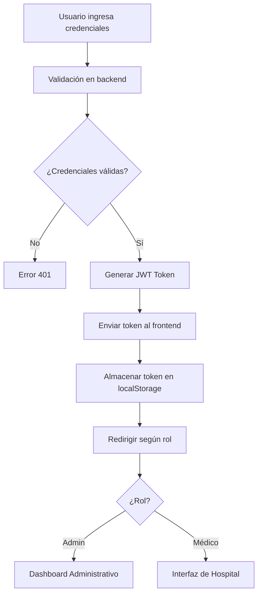

# 🏥 Sistema de Gestión Hospitalaria - HospitalApp

[](https://nodejs.org/)
[](https://reactjs.org/)
[](https://www.typescriptlang.org/)
[](https://www.mysql.com/)
[](LICENSE)

## 📋 Descripción del Proyecto

**HospitalApp** es un sistema integral de gestión hospitalaria desarrollado con arquitectura de microservicios que permite la administración de múltiples centros médicos, personal, pacientes y consultas médicas. El sistema implementa bases de datos distribuidas, replicación de datos y servicios web para garantizar la escalabilidad y disponibilidad del servicio.

### 🎯 Objetivos Cumplidos

- ✅ **Arquitectura de Microservicios** con Node.js y Express
- ✅ **Bases de Datos Distribuidas** con MySQL
- ✅ **APIs RESTful** para administración y consultas médicas
- ✅ **Interfaces de Usuario** diferenciadas por roles (Admin/Hospital)
- ✅ **Sistema de Autenticación** con JWT y roles
- ✅ **Reportes Avanzados** con exportación a PDF
- ✅ **Gestión de Consultas** independiente por centro médico

## 🏗️ Arquitectura del Sistema

```
┌─────────────────────────────────────────────────────────────┐
│                    FRONTEND (React)                        │
├─────────────────────────────────────────────────────────────┤
│  ┌─────────────────┐  ┌─────────────────┐  ┌─────────────┐ │
│  │   Admin Panel   │  │  Hospital UI    │  │  Dashboard  │ │
│  │   (React)       │  │  (React)        │  │  (React)    │ │
│  └─────────────────┘  └─────────────────┘  └─────────────┘ │
└─────────────────────────────────────────────────────────────┘
                              │
                              ▼
┌─────────────────────────────────────────────────────────────┐
│                    API GATEWAY                             │
├─────────────────────────────────────────────────────────────┤
│  ┌─────────────────┐  ┌─────────────────┐  ┌─────────────┐ │
│  │  Auth Service   │  │  Admin Service  │  │  Reports    │ │
│  │  (JWT)          │  │  (CRUD)         │  │  Service    │ │
│  └─────────────────┘  └─────────────────┘  └─────────────┘ │
└─────────────────────────────────────────────────────────────┘
                              │
                              ▼
┌─────────────────────────────────────────────────────────────┐
│                DATABASES DISTRIBUTED                       │
├─────────────────────────────────────────────────────────────┤
│  ┌─────────────────┐  ┌─────────────────┐  ┌─────────────┐ │
│  │  Central DB     │  │  Guayaquil DB   │  │  Cuenca DB  │ │
│  │  (Quito)        │  │  (Local)        │  │  (Local)    │ │
│  └─────────────────┘  └─────────────────┘  └─────────────┘ │
└─────────────────────────────────────────────────────────────┘
```

## 🚀 Tecnologías Utilizadas

### Backend
- **Node.js** (v18+) - Runtime de JavaScript
- **Express.js** (v5.1.0) - Framework web
- **TypeScript** (v5.9.2) - Tipado estático
- **MySQL2** (v3.15.0) - Driver de base de datos
- **JWT** (v9.0.2) - Autenticación
- **bcrypt** (v6.0.0) - Encriptación de contraseñas
- **CORS** (v2.8.5) - Cross-Origin Resource Sharing
- **Nodemailer** (v6.10.1) - Envío de emails

### Frontend
- **React** (v19.1.1) - Biblioteca de UI
- **TypeScript** (v5.8.3) - Tipado estático
- **Vite** (v7.1.2) - Build tool y dev server
- **Tailwind CSS** (v4.1.13) - Framework CSS
- **React Router** (v7.8.2) - Enrutamiento
- **Zustand** (v5.0.8) - Estado global
- **Recharts** (v3.2.1) - Gráficos y visualizaciones
- **React Big Calendar** (v1.19.4) - Componente de calendario
- **jsPDF** (v3.0.3) - Generación de PDFs
- **Lucide React** (v0.542.0) - Iconos

### Base de Datos
- **MySQL** (v8.0+) - Sistema de gestión de base de datos
- **Arquitectura Distribuida** - Múltiples instancias por región

## 📁 Estructura del Proyecto

```
hospital-app/
├── 📁 backend/                    # Servidor Node.js
│   ├── 📁 src/
│   │   ├── 📁 config/            # Configuración de BD y variables
│   │   ├── 📁 controllers/       # Lógica de negocio
│   │   ├── 📁 middlewares/       # Middlewares de autenticación y validación
│   │   ├── 📁 routes/            # Definición de rutas API
│   │   └── 📁 docs/              # Documentación API (Postman)
│   ├── 📄 package.json           # Dependencias del backend
│   ├── 📄 sql.txt               # Scripts de base de datos
│   └── 📄 README.md             # Documentación del backend
│
├── 📁 frontend/                   # Cliente React
│   └── 📁 vite-project/
│       ├── 📁 src/
│       │   ├── 📁 api/           # Servicios de API
│       │   ├── 📁 components/    # Componentes reutilizables
│       │   ├── 📁 contexts/      # Contextos de React
│       │   ├── 📁 hooks/         # Custom hooks
│       │   ├── 📁 layouts/       # Layouts de páginas
│       │   ├── 📁 pages/         # Páginas de la aplicación
│       │   ├── 📁 routes/        # Configuración de rutas
│       │   ├── 📁 store/         # Estado global (Zustand)
│       │   ├── 📁 types/         # Definiciones de TypeScript
│       │   └── 📁 utils/         # Utilidades y helpers
│       ├── 📄 package.json       # Dependencias del frontend
│       └── 📄 vite.config.ts     # Configuración de Vite
│
└── 📄 README.md                   # Este archivo
```

## 🛠️ Instalación y Configuración

### Prerrequisitos

- **Node.js** v18 o superior
- **MySQL** v8.0 o superior
- **npm** o **yarn**

### 1. Clonar el Repositorio

```bash
git clone <repository-url>
cd hospital-app
```

### 2. Configurar Base de Datos

#### Crear Bases de Datos Distribuidas

```sql
-- Servidor Central (Quito)
CREATE DATABASE hospital_central;
CREATE USER 'admin_central'@'%' IDENTIFIED BY 'SuperPasswordCentral123!';
GRANT ALL PRIVILEGES ON hospital_central.* TO 'admin_central'@'%';

-- Servidor Guayaquil
CREATE DATABASE hospital_guayaquil;
CREATE USER 'admin_guayaquil'@'%' IDENTIFIED BY 'SuperPasswordGye123!';
GRANT ALL PRIVILEGES ON hospital_guayaquil.* TO 'admin_guayaquil'@'%';

-- Servidor Cuenca
CREATE DATABASE hospital_cuenca;
CREATE USER 'admin_cuenca'@'%' IDENTIFIED BY 'SuperPasswordCuenca123!';
GRANT ALL PRIVILEGES ON hospital_cuenca.* TO 'admin_cuenca'@'%';

FLUSH PRIVILEGES;
```

#### Ejecutar Scripts de Base de Datos

```bash
# Ejecutar el archivo sql.txt en cada base de datos
mysql -u admin_central -p hospital_central < backend/sql.txt
mysql -u admin_guayaquil -p hospital_guayaquil < backend/sql.txt
mysql -u admin_cuenca -p hospital_cuenca < backend/sql.txt
```

### 3. Configurar Backend

```bash
cd backend

# Instalar dependencias
npm install

# Configurar variables de entorno
cp env.example .env

# Editar archivo .env con tus configuraciones
nano .env
```

#### Variables de Entorno (.env)

```env
# Base de Datos
DB_HOST=localhost
DB_PORT=3306
DB_USER=admin_central
DB_PASS=SuperPasswordCentral123!
DB_NAME=hospital_central

# JWT
JWT_SECRET=tu_jwt_secret_muy_seguro_aqui
JWT_EXPIRES_IN=24h

# Servidor
PORT=3000
NODE_ENV=development

# Email (opcional)
EMAIL_HOST=smtp.gmail.com
EMAIL_PORT=587
EMAIL_USER=tu_email@gmail.com
EMAIL_PASS=tu_password_de_aplicacion
```

### 4. Configurar Frontend

```bash
cd frontend/vite-project

# Instalar dependencias
npm install

# Configurar variables de entorno
cp .env.example .env.local

# Editar archivo .env.local
nano .env.local
```

#### Variables de Entorno Frontend (.env.local)

```env
VITE_API_URL=http://localhost:3000/api
VITE_APP_NAME=Sistema de Gestión Hospitalaria
VITE_APP_VERSION=1.0.0
VITE_DEBUG=true
```

### 5. Ejecutar la Aplicación

#### Terminal 1 - Backend
```bash
cd backend
npm start
```

#### Terminal 2 - Frontend
```bash
cd frontend/vite-project
npm run dev
```

La aplicación estará disponible en:
- **Frontend**: http://localhost:5173
- **Backend API**: http://localhost:3000/api

## 🔐 Sistema de Autenticación

### Roles de Usuario

1. **Administrador** (`admin`)
   - Acceso completo al sistema
   - Gestión de centros médicos
   - Gestión de médicos y empleados
   - Acceso a reportes globales
   - Gestión de usuarios

2. **Médico** (`medico`)
   - Acceso limitado a su centro médico
   - Gestión de consultas propias
   - Visualización de pacientes
   - Acceso a calendario personal

### Flujo de Autenticación



## 📊 Funcionalidades Principales

### 🏥 Gestión de Centros Médicos
- ✅ CRUD completo de centros médicos
- ✅ Asignación de personal por centro
- ✅ Gestión de ubicaciones y direcciones
- ✅ Estadísticas por centro

### 👨‍⚕️ Gestión de Personal Médico
- ✅ Registro de médicos con especialidades
- ✅ Asignación a centros médicos
- ✅ Gestión de empleados administrativos
- ✅ Control de acceso por roles

### 🩺 Sistema de Consultas Médicas
- ✅ Creación y gestión de consultas
- ✅ Estados de consulta (Pendiente, Programada, Completada, Cancelada)
- ✅ Asignación de pacientes a médicos
- ✅ Historial médico por paciente
- ✅ Calendario de consultas

### 📈 Sistema de Reportes
- ✅ Reportes por médico
- ✅ Estadísticas generales del centro
- ✅ Pacientes más frecuentes
- ✅ Gráficos y visualizaciones
- ✅ Exportación a PDF

### 👥 Gestión de Pacientes
- ✅ Registro de pacientes
- ✅ Historial médico
- ✅ Consultas activas
- ✅ Información de contacto

## 🔌 API Endpoints

### Autenticación
```
POST   /api/auth/login          # Iniciar sesión
POST   /api/auth/register       # Registrar usuario
GET    /api/auth/me             # Obtener perfil actual
```

### Administración
```
GET    /api/admin/centros       # Listar centros médicos
POST   /api/admin/centros       # Crear centro médico
PUT    /api/admin/centros/:id   # Actualizar centro médico
DELETE /api/admin/centros/:id   # Eliminar centro médico

GET    /api/admin/medicos       # Listar médicos
POST   /api/admin/medicos       # Crear médico
PUT    /api/admin/medicos/:id   # Actualizar médico
DELETE /api/admin/medicos/:id   # Eliminar médico

GET    /api/admin/empleados     # Listar empleados
POST   /api/admin/empleados     # Crear empleado
PUT    /api/admin/empleados/:id # Actualizar empleado
DELETE /api/admin/empleados/:id # Eliminar empleado

GET    /api/admin/especialidades    # Listar especialidades
POST   /api/admin/especialidades    # Crear especialidad
PUT    /api/admin/especialidades/:id # Actualizar especialidad
DELETE /api/admin/especialidades/:id # Eliminar especialidad
```

### Consultas Médicas
```
GET    /api/consultas           # Listar consultas
POST   /api/consultas           # Crear consulta
PUT    /api/consultas/:id       # Actualizar consulta
DELETE /api/consultas/:id       # Eliminar consulta

GET    /api/consultas/medicos   # Listar médicos disponibles
GET    /api/consultas/pacientes # Listar pacientes
```

### Reportes
```
GET    /api/reports/estadisticas        # Estadísticas generales
GET    /api/reports/consultas           # Resumen de consultas por médico
GET    /api/reports/pacientes-frecuentes # Pacientes más frecuentes
GET    /api/reports/consultas/:id/detalle # Detalle de consultas por médico
```

## 🗄️ Modelo de Base de Datos

### Entidades Principales

```sql
-- Centros Médicos
centros_medicos (id, nombre, ciudad, direccion)

-- Especialidades Médicas
especialidades (id, nombre)

-- Médicos
medicos (id, nombres, apellidos, id_especialidad, id_centro)

-- Empleados
empleados (id, nombres, apellidos, cargo, id_centro)

-- Pacientes
pacientes (id, nombres, apellidos, cedula, telefono, email, fecha_nacimiento, genero, id_centro)

-- Consultas Médicas
consultas (id, id_centro, id_medico, paciente_nombre, paciente_apellido, id_paciente, fecha, motivo, diagnostico, tratamiento, estado, duracion_minutos, created_at)

-- Usuarios del Sistema
usuarios (id, email, password_hash, rol, id_centro, id_medico, created_at)
```

## 🧪 Testing

### Backend
```bash
cd backend
npm test
```

### Frontend
```bash
cd frontend/vite-project
npm run test
```

## 📦 Scripts Disponibles

### Backend
```bash
npm start          # Iniciar servidor en producción
npm run dev        # Iniciar servidor en desarrollo
npm run build      # Compilar TypeScript
```

### Frontend
```bash
npm run dev        # Servidor de desarrollo
npm run build      # Construir para producción
npm run preview    # Vista previa de producción
npm run lint       # Linter de código
```

## 🚀 Despliegue

### Backend (Producción)
```bash
cd backend
npm install --production
npm start
```

### Frontend (Producción)
```bash
cd frontend/vite-project
npm run build
# Servir archivos estáticos desde la carpeta dist/
```

### Variables de Entorno de Producción

```env
NODE_ENV=production
DB_HOST=tu_servidor_db
DB_PORT=3306
DB_USER=usuario_produccion
DB_PASS=password_seguro
DB_NAME=hospital_produccion
JWT_SECRET=secret_muy_seguro_produccion
```

## 📚 Documentación de la API

### Swagger UI
- **URL**: `http://localhost:3000/api-docs`
- **Especificación OpenAPI**: `http://localhost:3000/api-docs.json`

### Características de la Documentación
- **Interfaz interactiva** para probar endpoints
- **Esquemas completos** de request/response
- **Ejemplos de uso** para cada endpoint
- **Autenticación integrada** con JWT
- **Filtros y búsquedas** documentadas
- **Documentación completa** en `backend/swagger.yaml`

## 📚 Documentación Adicional

- [Documentación del Backend](backend/BACKEND_DOCUMENTATION.md)
- [Documentación del Frontend](frontend/FRONTEND_DOCUMENTATION.md)
- [API de Autenticación](backend/API_DOCUMENTATION.md)
- [API de Administración](backend/ADMIN_API_DOCUMENTATION.md)
- [Colección de Postman](backend/src/docs/consultas.postman_collection.json)
- [Guía de Seguridad](README_SEGURIDAD.md)
- [Guía de Validaciones](README_VALIDACIONES.md)

## 🤝 Contribución

1. Fork el proyecto
2. Crea una rama para tu feature (`git checkout -b feature/AmazingFeature`)
3. Commit tus cambios (`git commit -m 'Add some AmazingFeature'`)
4. Push a la rama (`git push origin feature/AmazingFeature`)
5. Abre un Pull Request

## 📝 Licencia

Este proyecto está bajo la Licencia ISC. Ver el archivo [LICENSE](LICENSE) para más detalles.

## 👥 Autores

- **Tu Nombre** - *Desarrollo completo* - [@tuusuario](https://github.com/tuusuario)

## 🙏 Agradecimientos

- Universidad Técnica de Ambato
- Facultad de Ingeniería en Sistemas, Electrónica e Industrial
- Ing. Jose Caiza, Mg - Profesor de Aplicaciones Distribuidas

## 📞 Contacto

- **Email**: tu.email@ejemplo.com
- **Proyecto**: [https://github.com/tuusuario/hospital-app](https://github.com/tuusuario/hospital-app)

---

<div align="center">

**🏥 HospitalApp - Sistema de Gestión Hospitalaria 🏥**

*Desarrollado con ❤️ para la gestión eficiente de centros médicos*

[](https://www.typescriptlang.org/)
[](https://reactjs.org/)
[](https://nodejs.org/)

</div>
