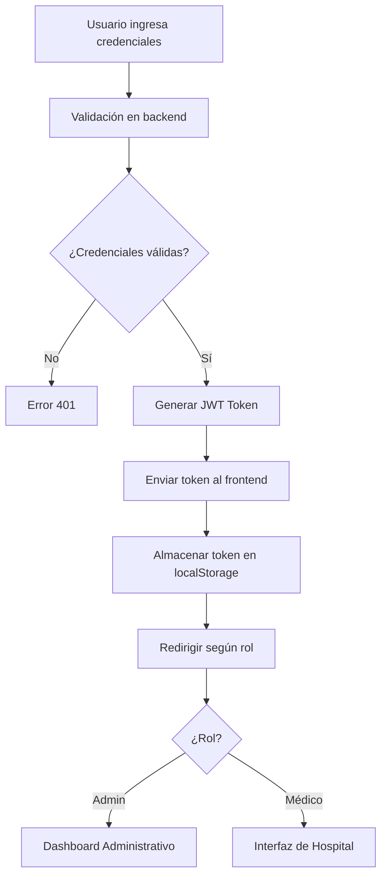

# 🏥 Sistema de Gestión Hospitalaria - HospitalApp

[](https://nodejs.org/)
[](https://reactjs.org/)
[](https://www.typescriptlang.org/)
[](https://www.mysql.com/)
[](https://docker.com/)
[](LICENSE)

## 📋 Descripción del Proyecto

**HospitalApp** es un sistema integral de gestión hospitalaria desarrollado con **arquitectura de microservicios** que permite la administración de múltiples centros médicos distribuidos geográficamente. El sistema implementa bases de datos distribuidas, replicación de datos y servicios web para garantizar la escalabilidad, disponibilidad y mantenibilidad del servicio.

### 🎯 Objetivos Cumplidos

- ✅ **Arquitectura de Microservicios** con Node.js y Express
- ✅ **Bases de Datos Distribuidas** con MySQL (Central, Guayaquil, Cuenca)
- ✅ **APIs RESTful** para administración y consultas médicas
- ✅ **Interfaces de Usuario** diferenciadas por roles (Admin/Hospital)
- ✅ **Sistema de Autenticación** con JWT y roles
- ✅ **Reportes Avanzados** con exportación a PDF
- ✅ **Gestión de Consultas** independiente por centro médico
- ✅ **Containerización** con Docker y Docker Compose
- ✅ **Logging y Monitoreo** con Winston
- ✅ **Validaciones Robustas** en frontend y backend

## 🏗️ Arquitectura del Sistema

### Diagrama de Arquitectura

```
┌─────────────────────────────────────────────────────────────┐
│                    FRONTEND (React + Vite)                 │
├─────────────────────────────────────────────────────────────┤
│  ┌─────────────────┐  ┌─────────────────┐  ┌─────────────┐ │
│  │   Admin Panel   │  │  Hospital UI    │  │  Dashboard  │ │
│  │   (React)       │  │  (React)        │  │  (React)    │ │
│  └─────────────────┘  └─────────────────┘  └─────────────┘ │
└─────────────────────────────────────────────────────────────┘
                              │
                              ▼
┌─────────────────────────────────────────────────────────────┐
│                    API GATEWAY (Puerto 3000)               │
├─────────────────────────────────────────────────────────────┤
│  ┌─────────────────┐  ┌─────────────────┐  ┌─────────────┐ │
│  │  Auth Service   │  │  Admin Service  │  │  Reports    │ │
│  │  (Puerto 3001)  │  │  (Puerto 3002)  │  │  Service    │ │
│  └─────────────────┘  └─────────────────┘  └─────────────┘ │
│  ┌─────────────────┐  ┌─────────────────┐                  │
│  │ Consultas Svc   │  │  Users Service  │                  │
│  │  (Puerto 3003)  │  │  (Puerto 3004)  │                  │
│  └─────────────────┘  └─────────────────┘                  │
└─────────────────────────────────────────────────────────────┘
                              │
                              ▼
┌─────────────────────────────────────────────────────────────┐
│                DATABASES DISTRIBUTED                        │
├─────────────────────────────────────────────────────────────┤
│  ┌─────────────────┐  ┌─────────────────┐  ┌─────────────┐ │
│  │  Central DB     │  │  Guayaquil DB   │  │  Cuenca DB  │ │
│  │  (Puerto 3307)  │  │  (Puerto 3308)  │  │  (Puerto 3309) │
│  │  Quito          │  │  Guayaquil      │  │  Cuenca     │ │
│  └─────────────────┘  └─────────────────┘  └─────────────┘ │
└─────────────────────────────────────────────────────────────┘
```

### Microservicios

| Servicio | Puerto | Responsabilidad | Base de Datos |
|----------|--------|-----------------|---------------|
| **API Gateway** | 3000 | Enrutamiento, autenticación, proxy | - |
| **Auth Service** | 3001 | Autenticación, usuarios, JWT | Todas las BD |
| **Admin Service** | 3002 | Gestión de médicos, centros, especialidades | Todas las BD |
| **Consultas Service** | 3003 | Consultas médicas, pacientes | Todas las BD |
| **Users Service** | 3004 | Gestión de usuarios del sistema | Todas las BD |
| **Reports Service** | 3005 | Reportes y estadísticas | Todas las BD |

## 🚀 Tecnologías Utilizadas

### Backend (Microservicios)
- **Node.js** (v18+) - Runtime de JavaScript
- **Express.js** (v5.1.0) - Framework web
- **TypeScript** (v5.9.2) - Tipado estático
- **MySQL2** (v3.15.0) - Driver de base de datos
- **JWT** (v9.0.2) - Autenticación
- **bcryptjs** (v3.0.2) - Encriptación de contraseñas
- **CORS** (v2.8.5) - Cross-Origin Resource Sharing
- **Winston** (v3.11.0) - Logging
- **Express-validator** (v7.0.1) - Validaciones
- **Express-rate-limit** (v7.1.5) - Rate limiting
- **Helmet** (v7.1.0) - Seguridad HTTP

### Frontend
- **React** (v19.1.1) - Biblioteca de UI
- **TypeScript** (v5.8.3) - Tipado estático
- **Vite** (v7.1.2) - Build tool y dev server
- **Tailwind CSS** (v4.1.13) - Framework CSS
- **React Router** (v7.8.2) - Enrutamiento
- **Zustand** (v5.0.8) - Estado global
- **Recharts** (v3.2.1) - Gráficos y visualizaciones
- **React Big Calendar** (v1.19.4) - Componente de calendario
- **jsPDF** (v3.0.3) - Generación de PDFs
- **Lucide React** (v0.542.0) - Iconos
- **Moment.js** (v2.30.1) - Manipulación de fechas

### Base de Datos y DevOps
- **MySQL** (v8.0+) - Sistema de gestión de base de datos
- **Docker** (v24+) - Containerización
- **Docker Compose** (v2.0+) - Orquestación de contenedores
- **Arquitectura Distribuida** - Múltiples instancias por región

## 📁 Estructura del Proyecto

```
hospital-app/
├── 📁 microservices/              # Arquitectura de Microservicios
│   ├── 📁 api-gateway/           # Gateway principal (Puerto 3000)
│   │   ├── 📄 index.js           # Servidor principal
│   │   ├── 📄 package.json       # Dependencias
│   │   └── 📄 env.local          # Variables de entorno
│   ├── 📁 auth-service/           # Servicio de autenticación (Puerto 3001)
│   │   ├── 📄 index.js           # Servidor de autenticación
│   │   ├── 📄 package.json       # Dependencias
│   │   └── 📄 env.local          # Variables de entorno
│   ├── 📁 admin-service/          # Servicio administrativo (Puerto 3002)
│   │   ├── 📄 index.js           # Servidor administrativo
│   │   ├── 📄 package.json       # Dependencias
│   │   └── 📄 env.local          # Variables de entorno
│   ├── 📁 consultas-service/      # Servicio de consultas (Puerto 3003)
│   │   ├── 📄 index.js           # Servidor de consultas
│   │   ├── 📄 package.json       # Dependencias
│   │   └── 📄 env.local          # Variables de entorno
│   ├── 📁 users-service/          # Servicio de usuarios (Puerto 3004)
│   │   ├── 📄 index.js           # Servidor de usuarios
│   │   ├── 📄 package.json       # Dependencias
│   │   └── 📄 env.local          # Variables de entorno
│   ├── 📁 reports-service/        # Servicio de reportes (Puerto 3005)
│   │   ├── 📄 index.js           # Servidor de reportes
│   │   ├── 📄 package.json       # Dependencias
│   │   ├── 📄 env.local          # Variables de entorno
│   │   └── 📁 logs/              # Archivos de log
│   ├── 📁 sql/                   # Scripts de base de datos
│   │   ├── 📄 setup-central.sql  # Configuración BD Central
│   │   ├── 📄 setup-guayaquil.sql # Configuración BD Guayaquil
│   │   ├── 📄 setup-cuenca.sql   # Configuración BD Cuenca
│   │   └── 📄 setup-users.sql    # Configuración usuarios
│   ├── 📄 docker-compose.yml     # Orquestación de contenedores
│   ├── 📄 insert-sample-data.js  # Datos de prueba
│   └── 📄 reset-databases.js     # Reset de bases de datos
│
├── 📁 frontend/                   # Cliente React
│   └── 📁 vite-project/
│       ├── 📁 src/
│       │   ├── 📁 api/           # Servicios de API
│       │   │   ├── 📄 authApi.ts # API de autenticación
│       │   │   ├── 📄 adminApi.ts # API administrativa
│       │   │   ├── 📄 consultasApi.ts # API de consultas
│       │   │   ├── 📄 pacientesApi.ts # API de pacientes
│       │   │   ├── 📄 reportsApi.ts # API de reportes
│       │   │   └── 📄 usersApi.ts # API de usuarios
│       │   ├── 📁 components/    # Componentes reutilizables
│       │   ├── 📁 contexts/      # Contextos de React
│       │   ├── 📁 hooks/         # Custom hooks
│       │   ├── 📁 layouts/       # Layouts de páginas
│       │   ├── 📁 pages/         # Páginas de la aplicación
│       │   ├── 📁 routes/        # Configuración de rutas
│       │   ├── 📁 store/         # Estado global (Zustand)
│       │   ├── 📁 types/         # Definiciones de TypeScript
│       │   └── 📁 utils/         # Utilidades y helpers
│       ├── 📄 package.json       # Dependencias del frontend
│       ├── 📄 vite.config.ts     # Configuración de Vite
│       ├── 📄 Dockerfile         # Containerización frontend
│       └── 📄 nginx.conf         # Configuración Nginx
│
├── 📄 README.md                   # Documentación principal
├── 📄 README_SEGURIDAD.md         # Documentación de seguridad
├── 📄 README_VALIDACIONES.md      # Documentación de validaciones
└── 📄 FRONTEND_DOCUMENTATION.md  # Documentación del frontend
```

## 🛠️ Instalación y Configuración

### Prerrequisitos

- **Node.js** v18 o superior
- **MySQL** v8.0 o superior
- **Docker** v24+ y **Docker Compose** v2.0+
- **npm** o **yarn**

### 1. Clonar el Repositorio

```bash
git clone <repository-url>
cd hospital-app
```

### 2. Configuración con Docker (Recomendado)

#### Opción A: Ejecución Completa con Docker

```bash
# Navegar al directorio de microservicios
cd microservices

# Ejecutar todos los servicios con Docker Compose
docker-compose up -d

# Verificar que todos los contenedores estén ejecutándose
docker-compose ps
```

#### Opción B: Configuración Manual

### 3. Configurar Bases de Datos Distribuidas

#### Crear Bases de Datos y Usuarios

```sql
-- Servidor Central (Puerto 3307)
CREATE DATABASE hospital_central;
CREATE USER 'admin_central'@'%' IDENTIFIED BY 'SuperPasswordCentral123!';
GRANT ALL PRIVILEGES ON hospital_central.* TO 'admin_central'@'%';

-- Servidor Guayaquil (Puerto 3308)
CREATE DATABASE hospital_guayaquil;
CREATE USER 'admin_guayaquil'@'%' IDENTIFIED BY 'SuperPasswordGye123!';
GRANT ALL PRIVILEGES ON hospital_guayaquil.* TO 'admin_guayaquil'@'%';

-- Servidor Cuenca (Puerto 3309)
CREATE DATABASE hospital_cuenca;
CREATE USER 'admin_cuenca'@'%' IDENTIFIED BY 'SuperPasswordCuenca123!';
GRANT ALL PRIVILEGES ON hospital_cuenca.* TO 'admin_cuenca'@'%';

FLUSH PRIVILEGES;
```

#### Ejecutar Scripts de Configuración

```bash
# Configurar bases de datos
cd microservices/sql

# Central (Puerto 3307)
mysql -u admin_central -p -P 3307 hospital_central < setup-central.sql

# Guayaquil (Puerto 3308)
mysql -u admin_guayaquil -p -P 3308 hospital_guayaquil < setup-guayaquil.sql

# Cuenca (Puerto 3309)
mysql -u admin_cuenca -p -P 3309 hospital_cuenca < setup-cuenca.sql

# Configurar usuarios del sistema
mysql -u admin_central -p -P 3307 hospital_central < setup-users.sql
```

### 4. Configurar Microservicios

#### Variables de Entorno por Servicio

Cada microservicio requiere su archivo `env.local`:

```bash
# Copiar archivos de ejemplo
cd microservices
cp api-gateway/env.example api-gateway/env.local
cp auth-service/env.example auth-service/env.local
cp admin-service/env.example admin-service/env.local
cp consultas-service/env.example consultas-service/env.local
cp users-service/env.example users-service/env.local
cp reports-service/env.example reports-service/env.local
```

#### Ejemplo de Variables de Entorno (auth-service/env.local)

```env
# Base de Datos
DB_HOST=localhost
DB_PORT=3307
DB_USER=admin_central
DB_PASS=SuperPasswordCentral123!
DB_NAME=hospital_central

# JWT
JWT_SECRET=tu_jwt_secret_muy_seguro_aqui
JWT_EXPIRES_IN=24h

# Servidor
PORT=3001
NODE_ENV=development

# Otros servicios
ADMIN_SERVICE_URL=http://localhost:3002
CONSULTAS_SERVICE_URL=http://localhost:3003
USERS_SERVICE_URL=http://localhost:3004
REPORTS_SERVICE_URL=http://localhost:3005
```

### 5. Instalar Dependencias

```bash
# Instalar dependencias de todos los microservicios
cd microservices
npm install

# Instalar dependencias del frontend
cd ../frontend/vite-project
npm install
```

### 6. Ejecutar la Aplicación

#### Opción A: Con Docker Compose (Recomendado)

```bash
cd microservices
docker-compose up -d

# En otra terminal, ejecutar frontend
cd ../frontend/vite-project
npm run dev
```

#### Opción B: Ejecución Manual

```bash
# Terminal 1 - API Gateway
cd microservices/api-gateway
npm start

# Terminal 2 - Auth Service
cd microservices/auth-service
npm start

# Terminal 3 - Admin Service
cd microservices/admin-service
npm start

# Terminal 4 - Consultas Service
cd microservices/consultas-service
npm start

# Terminal 5 - Users Service
cd microservices/users-service
npm start

# Terminal 6 - Reports Service
cd microservices/reports-service
npm start

# Terminal 7 - Frontend
cd frontend/vite-project
npm run dev
```

### 7. Verificar Instalación

La aplicación estará disponible en:
- **Frontend**: http://localhost:5173
- **API Gateway**: http://localhost:3000
- **Auth Service**: http://localhost:3001
- **Admin Service**: http://localhost:3002
- **Consultas Service**: http://localhost:3003
- **Users Service**: http://localhost:3004
- **Reports Service**: http://localhost:3005

#### Verificar Servicios

```bash
# Verificar que todos los servicios estén ejecutándose
curl http://localhost:3000/health
curl http://localhost:3001/health
curl http://localhost:3002/health
curl http://localhost:3003/health
curl http://localhost:3004/health
curl http://localhost:3005/health
```

## 🔐 Sistema de Autenticación

### Roles de Usuario

1. **Administrador** (`admin`)
   - Acceso completo al sistema
   - Gestión de centros médicos
   - Gestión de médicos y empleados
   - Acceso a reportes globales
   - Gestión de usuarios

2. **Médico** (`medico`)
   - Acceso limitado a su centro médico
   - Gestión de consultas propias
   - Visualización de pacientes
   - Acceso a calendario personal

### Flujo de Autenticación



## 📊 Funcionalidades Principales

### 🏥 Gestión de Centros Médicos
- ✅ CRUD completo de centros médicos
- ✅ Asignación de personal por centro
- ✅ Gestión de ubicaciones y direcciones
- ✅ Estadísticas por centro

### 👨‍⚕️ Gestión de Personal Médico
- ✅ Registro de médicos con especialidades
- ✅ Asignación a centros médicos
- ✅ Gestión de empleados administrativos
- ✅ Control de acceso por roles

### 🩺 Sistema de Consultas Médicas
- ✅ Creación y gestión de consultas
- ✅ Estados de consulta (Pendiente, Programada, Completada, Cancelada)
- ✅ Asignación de pacientes a médicos
- ✅ Historial médico por paciente
- ✅ Calendario de consultas

### 📈 Sistema de Reportes
- ✅ Reportes por médico
- ✅ Estadísticas generales del centro
- ✅ Pacientes más frecuentes
- ✅ Gráficos y visualizaciones
- ✅ Exportación a PDF

### 👥 Gestión de Pacientes
- ✅ Registro de pacientes
- ✅ Historial médico
- ✅ Consultas activas
- ✅ Información de contacto

## 🔌 API Endpoints

### Autenticación
```
POST   /api/auth/login          # Iniciar sesión
POST   /api/auth/register       # Registrar usuario
GET    /api/auth/me             # Obtener perfil actual
```

### Administración
```
GET    /api/admin/centros       # Listar centros médicos
POST   /api/admin/centros       # Crear centro médico
PUT    /api/admin/centros/:id   # Actualizar centro médico
DELETE /api/admin/centros/:id   # Eliminar centro médico

GET    /api/admin/medicos       # Listar médicos
POST   /api/admin/medicos       # Crear médico
PUT    /api/admin/medicos/:id   # Actualizar médico
DELETE /api/admin/medicos/:id   # Eliminar médico

GET    /api/admin/empleados     # Listar empleados
POST   /api/admin/empleados     # Crear empleado
PUT    /api/admin/empleados/:id # Actualizar empleado
DELETE /api/admin/empleados/:id # Eliminar empleado

GET    /api/admin/especialidades    # Listar especialidades
POST   /api/admin/especialidades    # Crear especialidad
PUT    /api/admin/especialidades/:id # Actualizar especialidad
DELETE /api/admin/especialidades/:id # Eliminar especialidad
```

### Consultas Médicas
```
GET    /api/consultas           # Listar consultas
POST   /api/consultas           # Crear consulta
PUT    /api/consultas/:id       # Actualizar consulta
DELETE /api/consultas/:id       # Eliminar consulta

GET    /api/consultas/medicos   # Listar médicos disponibles
GET    /api/consultas/pacientes # Listar pacientes
```

### Reportes
```
GET    /api/reports/estadisticas        # Estadísticas generales
GET    /api/reports/consultas           # Resumen de consultas por médico
GET    /api/reports/pacientes-frecuentes # Pacientes más frecuentes
GET    /api/reports/consultas/:id/detalle # Detalle de consultas por médico
```

## 🗄️ Modelo de Base de Datos

### Entidades Principales

```sql
-- Centros Médicos
centros_medicos (id, nombre, ciudad, direccion)

-- Especialidades Médicas
especialidades (id, nombre)

-- Médicos
medicos (id, nombres, apellidos, id_especialidad, id_centro)

-- Empleados
empleados (id, nombres, apellidos, cargo, id_centro)

-- Pacientes
pacientes (id, nombres, apellidos, cedula, telefono, email, fecha_nacimiento, genero, id_centro)

-- Consultas Médicas
consultas (id, id_centro, id_medico, paciente_nombre, paciente_apellido, id_paciente, fecha, motivo, diagnostico, tratamiento, estado, duracion_minutos, created_at)

-- Usuarios del Sistema
usuarios (id, email, password_hash, rol, id_centro, id_medico, created_at)
```

## 🧪 Testing

### Backend
```bash
cd backend
npm test
```

### Frontend
```bash
cd frontend/vite-project
npm run test
```

## 📦 Scripts Disponibles

### Backend
```bash
npm start          # Iniciar servidor en producción
npm run dev        # Iniciar servidor en desarrollo
npm run build      # Compilar TypeScript
```

### Frontend
```bash
npm run dev        # Servidor de desarrollo
npm run build      # Construir para producción
npm run preview    # Vista previa de producción
npm run lint       # Linter de código
```

## 🚀 Despliegue

### Backend (Producción)
```bash
cd backend
npm install --production
npm start
```

### Frontend (Producción)
```bash
cd frontend/vite-project
npm run build
# Servir archivos estáticos desde la carpeta dist/
```

### Variables de Entorno de Producción

```env
NODE_ENV=production
DB_HOST=tu_servidor_db
DB_PORT=3306
DB_USER=usuario_produccion
DB_PASS=password_seguro
DB_NAME=hospital_produccion
JWT_SECRET=secret_muy_seguro_produccion
```

## 📚 Documentación de la API

### Swagger UI
- **URL**: `http://localhost:3000/api-docs`
- **Especificación OpenAPI**: `http://localhost:3000/api-docs.json`

### Características de la Documentación
- **Interfaz interactiva** para probar endpoints
- **Esquemas completos** de request/response
- **Ejemplos de uso** para cada endpoint
- **Autenticación integrada** con JWT
- **Filtros y búsquedas** documentadas
- **Documentación completa** en `backend/swagger.yaml`

## 📚 Documentación Adicional

- [Documentación del Backend](backend/BACKEND_DOCUMENTATION.md)
- [Documentación del Frontend](frontend/FRONTEND_DOCUMENTATION.md)
- [API de Autenticación](backend/API_DOCUMENTATION.md)
- [API de Administración](backend/ADMIN_API_DOCUMENTATION.md)
- [Colección de Postman](backend/src/docs/consultas.postman_collection.json)
- [Guía de Seguridad](README_SEGURIDAD.md)
- [Guía de Validaciones](README_VALIDACIONES.md)

## 🤝 Contribución

1. Fork el proyecto
2. Crea una rama para tu feature (`git checkout -b feature/AmazingFeature`)
3. Commit tus cambios (`git commit -m 'Add some AmazingFeature'`)
4. Push a la rama (`git push origin feature/AmazingFeature`)
5. Abre un Pull Request

## 📝 Licencia

Este proyecto está bajo la Licencia ISC. Ver el archivo [LICENSE](LICENSE) para más detalles.

## 👥 Autores

- **Tu Nombre** - *Desarrollo completo* - [@tuusuario](https://github.com/tuusuario)

## 🙏 Agradecimientos

- Universidad Técnica de Ambato
- Facultad de Ingeniería en Sistemas, Electrónica e Industrial
- Ing. Jose Caiza, Mg - Profesor de Aplicaciones Distribuidas

## 📞 Contacto

- **Email**: tu.email@ejemplo.com
- **Proyecto**: [https://github.com/tuusuario/hospital-app](https://github.com/tuusuario/hospital-app)

---

<div align="center">

**🏥 HospitalApp - Sistema de Gestión Hospitalaria 🏥**

*Desarrollado con ❤️ para la gestión eficiente de centros médicos*

[](https://www.typescriptlang.org/)
[](https://reactjs.org/)
[](https://nodejs.org/)

</div>
